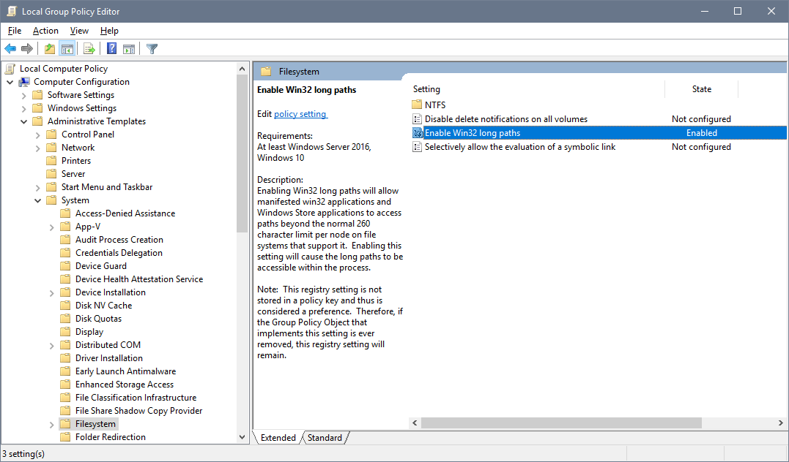
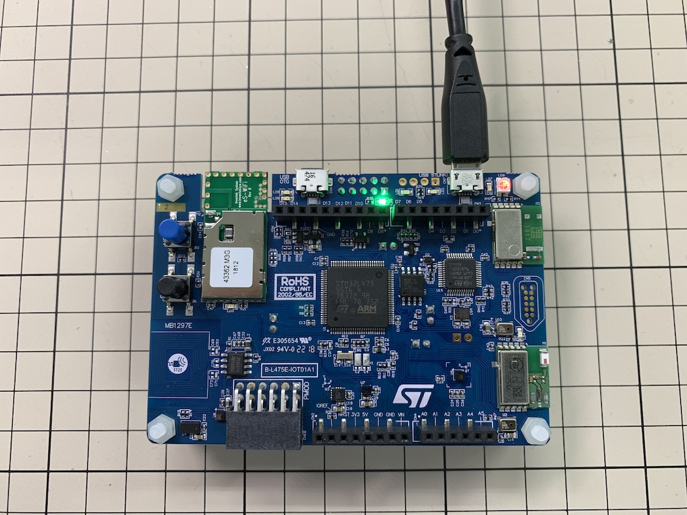
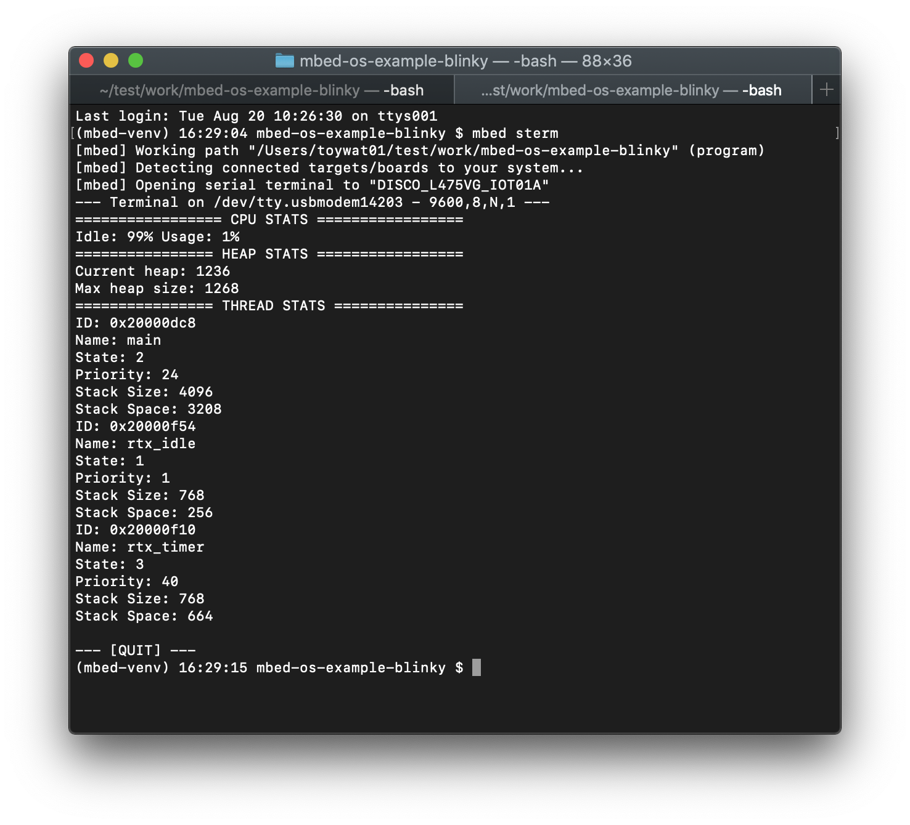
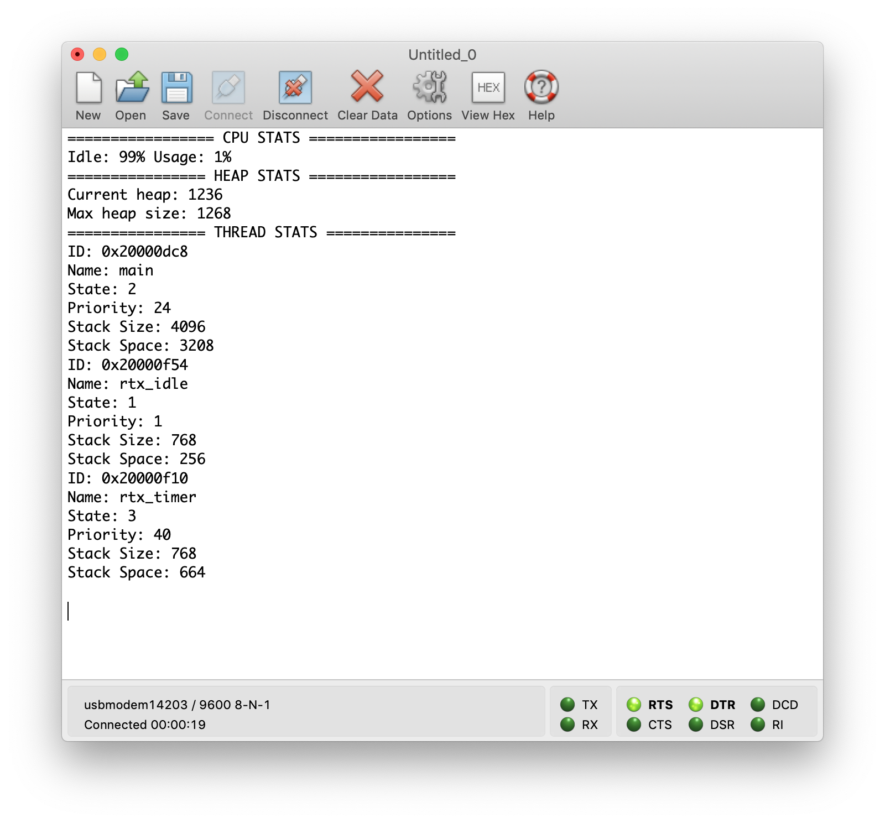

# Workshop 1 : Mbed CLIのインストールとビルド

このワークショップでは、以下を行います。

* Mbed CLI（オフライン開発環境）のインストール
* Mbed OSのサンプルコードのインポートとビルド
* ターゲットボードへの書き込みと実行

## インストール

以下のリンク先から、使用するホストマシン用のインストーラを使用して必要なソフトウェアをインストールします。

https://os.mbed.com/docs/mbed-os/v5.13/tools/installation-and-setup.html

インストール後に、最新版のモジュールにアップデートします。コマンドプロンプトやターミナルから以下のコマンドを実行します。

```shell
$ pip install -U mbed-cloud-sdk mbed-cli manifest-tool mbed-ls==1.7.8 mbed-host-tests==1.5.8 mbed-greentea==1.7.2
```
access permissionに関連するエラーが出る場合は、`--user`オプションも指定してください。

## Windowsのみ：MAX_PATH制限とGCC_ARMでのコンパイルエラー

Windowsのデフォルトの設定では、ファイルパスが長すぎるのでコンパイルエラーが発生する場合があります。このコンパイルエラーを避けるため、以下のグループポリシーを “Enabled" に設定します。  
* MMC （Windowsキー+Rでgpedit.mscを指定）> Local Computer Policy > Computer Configuration > Administrative Templates > System > Filesystem:  
* `Enable Win32 long paths`をダブルクリックしEnabledに設定する  
* コマンドラインで、`gpupdate /force`を実行する（その後、ログオフする）  



（参考）  
https://blogs.msdn.microsoft.com/jeremykuhne/2016/07/30/net-4-6-2-and-long-paths-on-windows-10/  
https://docs.microsoft.com/en-gb/windows/desktop/FileIO/naming-a-file  
https://bugs.python.org/issue27731  

## サンプルコードBlinkyをインポートする

* ターミナルやコマンドプロンプトを開く
* 作業用ディレクトリのルートに移動する

```shell
$ mbed import http://github.com/ARMmbed/mbed-os-example-blinky
$ cd mbed-os-example-blinky
```

* USBケーブルでボードとホストマシンを接続し、ボードを検出する



```shell
$ mbed detect
```
以下の情報が表示されます。
```
[mbed] Detected DISCO_L475VG_IOT01A, port /dev/tty.usbmodem14203, mounted /Volumes/DIS_L4IOT, interface version 0221:
[mbed] Supported toolchains for DISCO_L475VG_IOT01A
| Target              | mbed OS 2 | mbed OS 5 |    uARM   |    IAR    |    ARM    |  GCC_ARM  | ARMC5 |
|---------------------|-----------|-----------|-----------|-----------|-----------|-----------|-------|
| DISCO_L475VG_IOT01A | Supported | Supported | Supported | Supported | Supported | Supported |   -   |
Supported targets: 1
Supported toolchains: 4
```

## サンプルコードをビルドする

```shell
$ mbed compile -t <toolchain> -m <module>  
```
このワークショップではtoolchainに、GCC_ARMが指定可能です。moduleには、mbed detectコマンドで表示された Target名を使用します。  

実行例:
```shell
$ mbed compile -t GCC_ARM -m DISCO_L475VG_IOT01A
```

ビルドされたバイナリファイルをUSBマスストレージにドラッグアンドドロップするか、以下のようにコマンドを実行します。

```shell
$ cp BUILD/<target>/<toolchain>/mbed-os-example-blinky.bin <mount point>
```
実行例: 

```shell
# MacOSの場合
$ cp BUILD/DISCO_L475VG_IOT01A/GCC_ARM/mbed-os-example-blinky.bin /Volumes/DIS_L4IOT/
# Windowsの場合
> copy .\BUILD\DISCO_L475VG_IOT01A\GCC_ARM\mbed-os-example-blinky.bin D:
```

## シリアルポートをモニタする

様々なシリアルポートモニタのソフトウェアが使用可能です。例：CoolTerm、TeraTerm、またはMbed CLIの `mbed sterm`コマンドが使用できます。




## サンプルコードを変更してビルドする

変更の例:
* シリアルポートに特定の文字列を表示する
* LEDの点滅パターンを変更する

編集するファイルは、サンプルコードのトップレベルディレクトリ (mbed-os-example-blinky) の main.cpp です。
