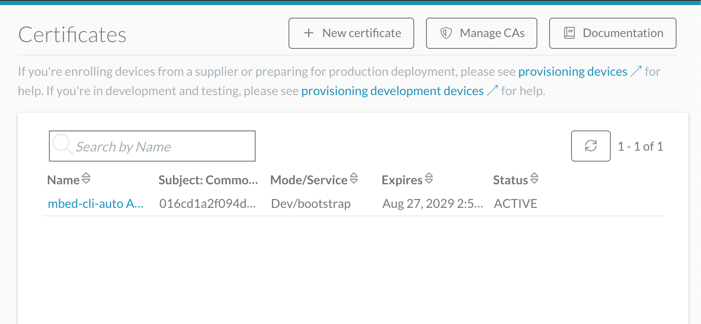
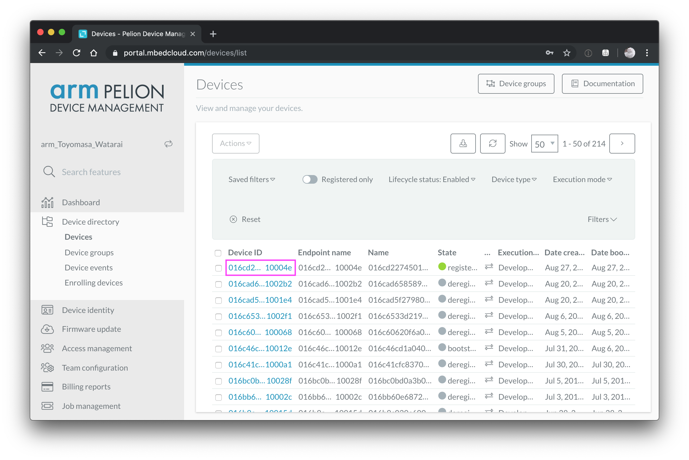
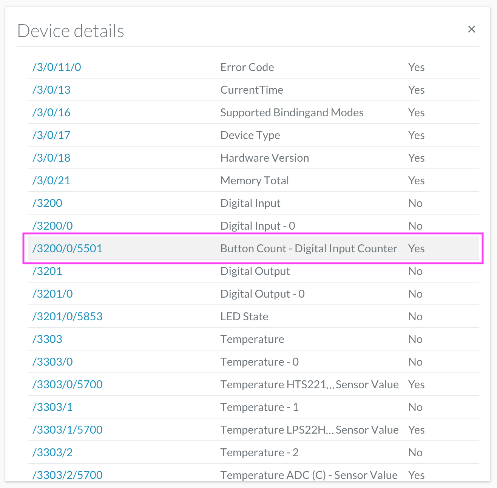
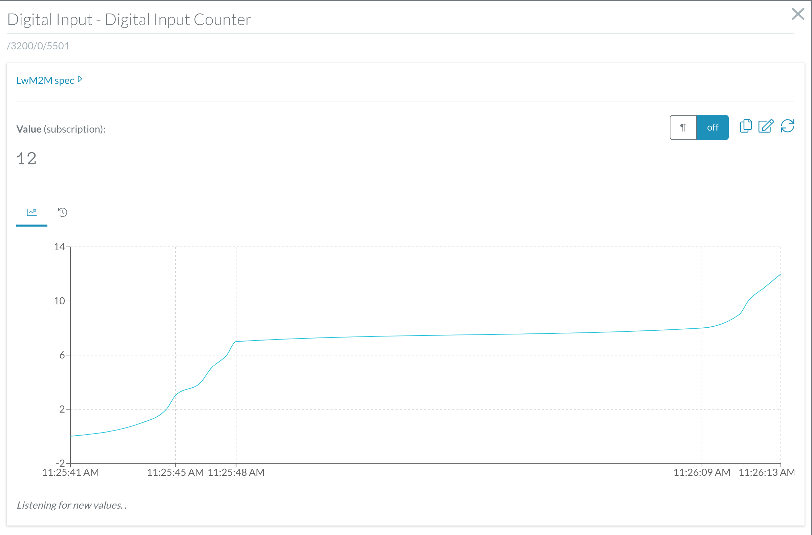

# Workshop 3 : Pelion Device Management

## MCUフラッシュメモリの消去

ワークショップで貸し出すボードは、予め初期化済みなのでこの手順は不要です。

ST-Linkユーティリティを使って、DISCO_L475VG_IOT01AのMCU内蔵フラッシュメモリを初期化します（以前の認証データ等を消去する）。


アドレス`0x08000000`以降が`0xFFFFFFFF`に消去されている事を確認します。


## Pelion Device Managementのアカウントを作成する

Pelion Device Managementのアカウントを取得済みの場合は、この手順は不要です。

以下のリンク先から、Pelion Device Managementの無償評価用アカウントを取得してください。

https://os.mbed.com/pelion-free-tier/

Mbedアカウントでサインイン済みの場合は、以下の画面が表示されます。


Mbedアカウントを作成していない場合は、以下の画面が表示されます。


## ポータルサイトにアクセスする

スクロールダウンして、`Launch the Portal`ボタンをクリックする。


## ポータルにサインインする
https://portal.mbedcloud.com/login

`Log in with account.mbed.com`をクリックする。


## ポータルサイトのダッシュボードが表示される


## プログラムのインポートとmanifestツールのインストール

コマンドラインから、以下のコマンドを実行します。

```shell
$ mbed import https://os.mbed.com/teams/ST/code/pelion-example-disco-iot01/
```
manifestツールがインストールされているか確認します。

```shell
$ manifest-tool -h
```

上記コマンドでエラーが出る場合は、manifestツールをインストールします。Macの場合は、`--user`オプションも指定します。

```shell
$ pip install -U "git+https://github.com/ARMmbed/manifest-tool"
```
Access permissionに関連するエラーが出た場合は、`--user`オプションも指定してください。

## PelionポータルサイトからAPIキーを取得する

Pelionポータルサイトに戻り、ログインしていない場合はログインしてください。
* `Access Management`メニューを選択する
* `API keys`をクリックし、`New API key`ボタンを押す
  * 任意のキー名称を入力し、`Developers`グループを選択し、`Create API key`ボタンを押す
  * re-authenticate（再認証）が必要になるので、パスワードを入力する
  * 後から参照できるようにAPIキーのテキストをコピーして、ファイルとしてローカルのPCに保存する
  * ブラウザの設定によってはポップアップを有効にする必要があります
* Mbed CLIコンフィギュレーションをグローバルに設定する

```shell
$ mbed config -G CLOUD_SDK_API_KEY <api key>
```

## デバイス管理情報を設定する

デバイス開発証明書やファームウェアアップデート用の証明書を作成します。`mbed dm init`コマンドで各種ファイルを作成します。

```shell
$ cd pelion-example-disco-iot01
$ mbed dm init -d "arm.com" --model-name "My-device-rev-1" -f -v
```

表示される質問にしたがって、証明書署名要求を生成します（これは、開発者モードの資格情報の作成に使用されます）。カントリーには2文字のカントリーコードを使用します（日本=JP）。以下に設定例を示します。

```
In which country is the subject located? JP 
In which state or province is the subject located? Kanagawa
In which city or region is the subject located? Yokohama
What is the name of the subject organization? Arm K.K.
What is the common name of the subject organization? [arm.com]
How long (in days) should the certificate be valid? [90]
```

正しく設定されると、ポータルサイトに開発者証明書が登録されます（既に登録済みの場合は、再利用されます）。



## アプリケーションにネットワーク情報を設定する

`mbed_app.json`ファイルをエディタで開いて編集します。

```json
            "nsapi.default-wifi-security"               : "WPA_WPA2",
            "nsapi.default-wifi-ssid"                   : "\"SSID\"",
            "nsapi.default-wifi-password"               : "\"Password\""
```
`SSID`と`Password`の部分を、使用するWi-Fiアクセスポイントの設定に変更します（ワークショップによって異なるので注意してください）。

設定例：
```json
            "nsapi.default-wifi-security"               : "WPA_WPA2",
            "nsapi.default-wifi-ssid"                   : "\"ArmWorkshop\"",
            "nsapi.default-wifi-password"               : "\"ArmWorkshop\""
```

## ビルドとバイナリの書き込み

以下のコマンドでビルドします。

```shell
$ mbed compile -t GCC_ARM -m DISCO_L475VG_IOT01A
```
ビルドされたバイナリファイルをUSBドライブにドラッグアンドドロップ、またはコピーコマンドで書き込みます。バイナリファイルは、`<your board example>/BUILD/<your board type>/GCC_ARM/`配下に生成されています。

```
./BUILD/DISCO_L475VG_IOT01A/GCC_ARM/pelion-example-disco-iot01.bin
```
バイナリファイルの書き込み例：

```shell
$ cp ./BUILD/DISCO_L475VG_IOT01A/GCC_ARM/pelion-example-disco-iot01.bin /Volumes/DIS_L4IOT/
```


## シリアル出力

TeraTerm, CoolTerm, Mbed CLI等の各種シリアルモニタが使用可能です。ボーレートは、115200です。  
Mbed CLIのシリアルもにた機能を使う場合は、以下のコマンドを実行します。

```shell
$ mbed sterm -b 115200
```

デバイスがPelion Device Managementサービスに登録されると、シリアル出力からはEndpoint名が表示されます。

```
Connecting to the network using Wifi...
Connected to the network successfully. IP address: 192.168.0.139
Initializing Pelion Device Management Client...
Initialized Pelion Client. Registering...
Registered to Pelion Device Management. Endpoint Name: 016cd22745010000000000010010004e
```
## ポータルサイトから登録デバイスを確認する

ポータルサイトにアクセスし、Device direcotry上に登録されているデバイスを確認します。



## リソースを表示する

ボタンカウントリソースを表示し、ダブルクリックします。

Device Direcotry > Devices > Device details > RESOURCES > 3200/0/5501



ボード上の青色のユーザボタンを押すと、押した回数がグラフで表示されます。

