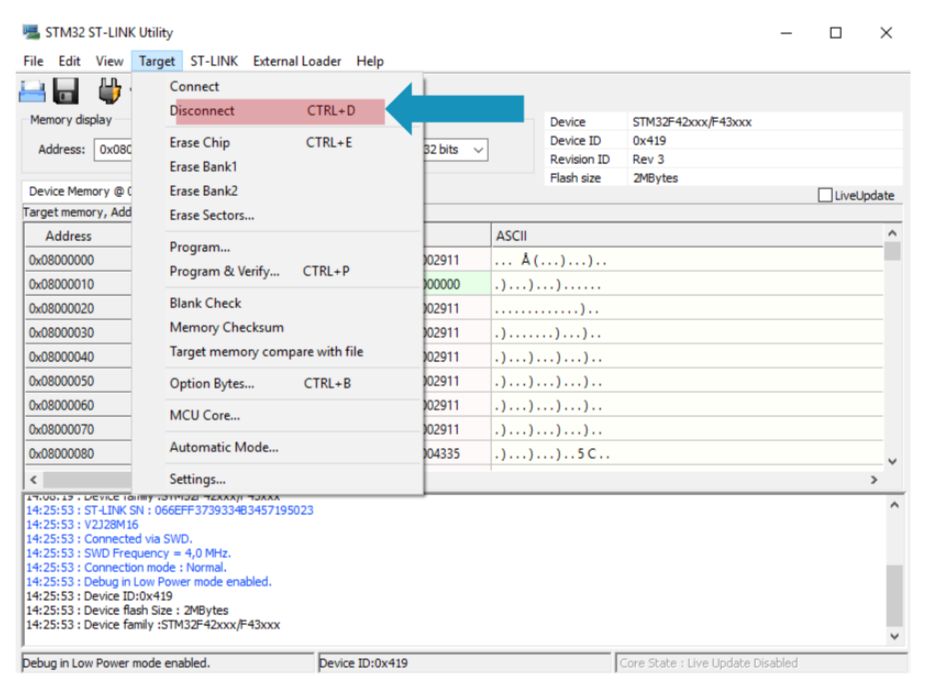
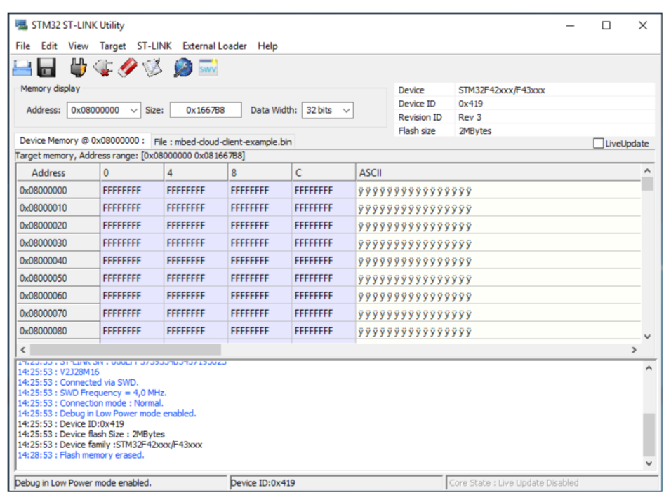
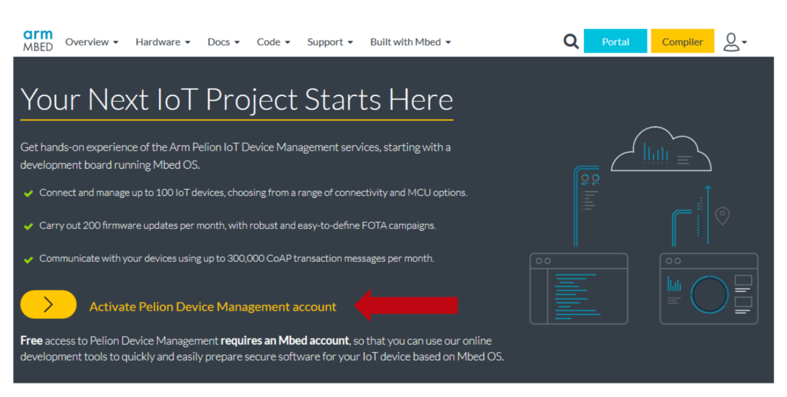
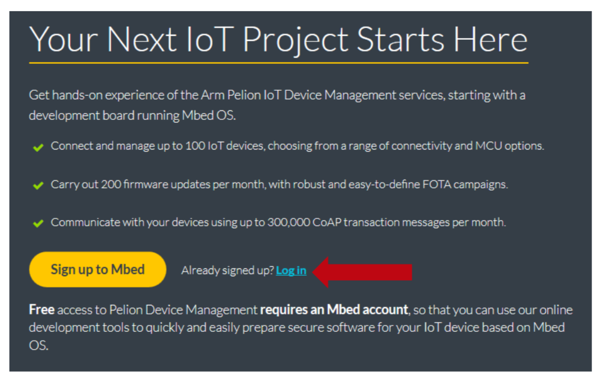
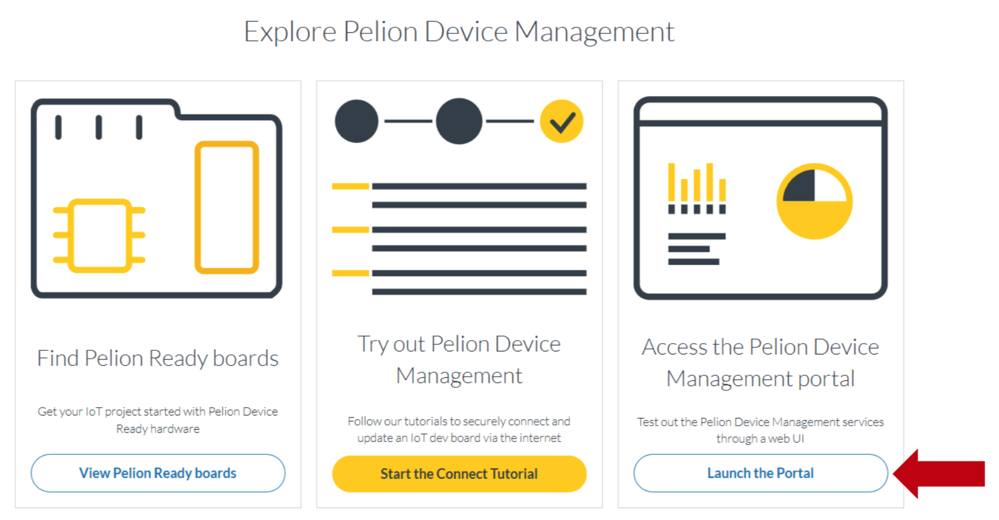
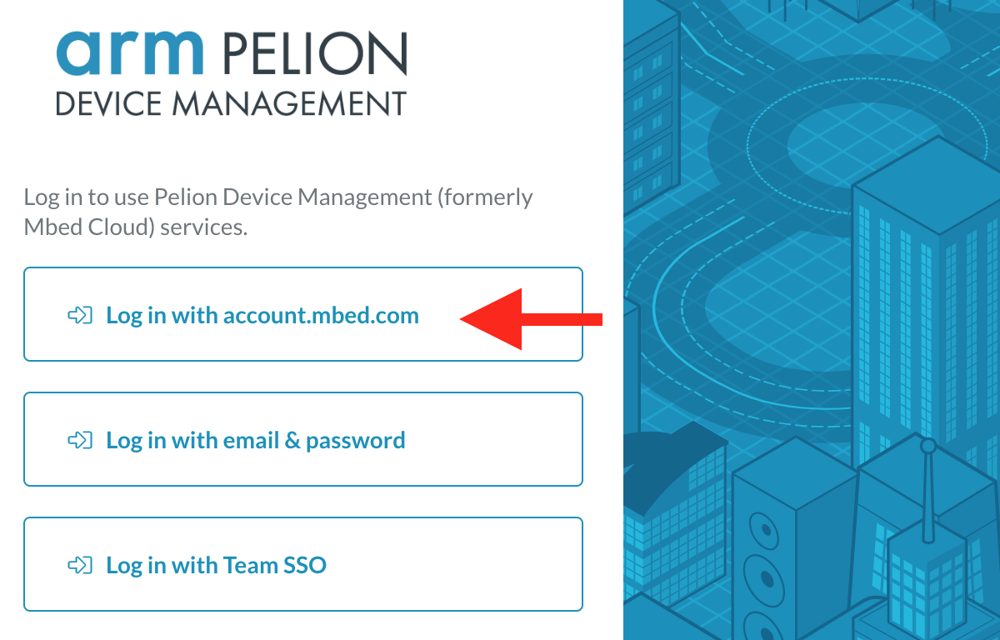
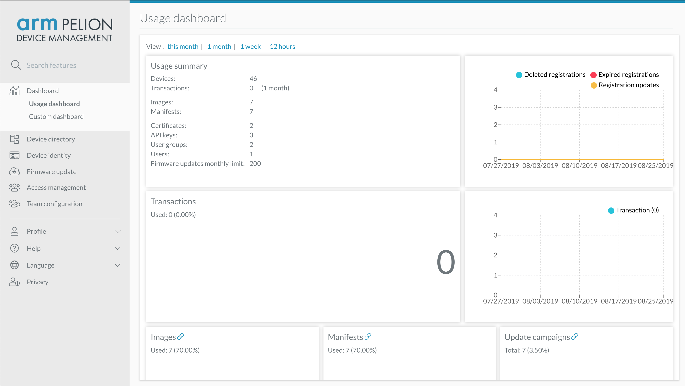

# Workshop 3 : Pelion Device Management

## MCUフラッシュメモリの消去

ワークショップで貸し出すボードは、予め初期化済みなのでこの手順は不要です。

ST-Linkユーティリティを使って、DISCO_L475VG_IOT01AのMCU内蔵フラッシュメモリを初期化します（以前の認証データ等を消去する）。



アドレス`0x08000000`以降が`0xFFFFFFFF`に消去されている事を確認します。



## Pelion Device Managementのアカウントを作成する

Pelion Device Managementのアカウントを取得済みの場合は、この手順は不要です。

以下のリンク先から、Pelion Device Managementの無償評価用アカウントを取得してください。

https://os.mbed.com/pelion-free-tier/

Mbedアカウントでサインイン済みの場合は、以下の画面が表示されます。


Mbedアカウントを作成していない場合は、以下の画面が表示されます。


## ポータルサイトにアクセスする

スクロールダウンして、`Launch the Portal`ボタンをクリックする。



## ポータルにサインインする
https://portal.mbedcloud.com/login

`Log in with account.mbed.com`をクリックする。



## ポータルサイトのダッシュボードが表示される



## プログラムのインポートとmanifestツールのインストール

コマンドラインから、以下のコマンドを実行します。

```
$ mbed import https://os.mbed.com/teams/ST/code/pelion-example-disco-iot01/
$ cd pelion-example-disco-iot01
```
manifestツールがインストールされているか確認します。

```
$ manifest-tool -h
```

上記コマンドでエラーが出る場合は、manifestツールをインストールします。

```
pip install –U "git+https://github.com/ARMmbed/manifest-tool"
```

## PelionポータルサイトからAPIキーを取得する

