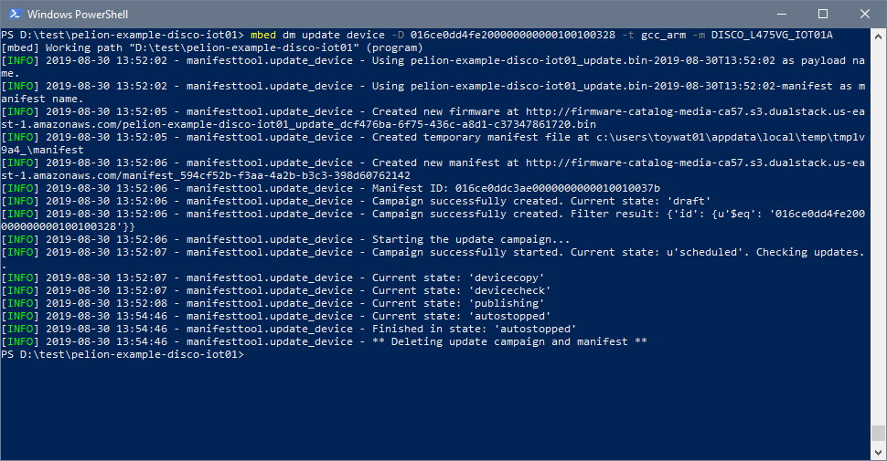

# Workshop 4 : Firmware update
<!---
## Why is the hands-on different?
* No multi device campaign. Everyone update their own single device.
* *Not preceded by Factory Provisioning with FCU, use mbed dm init to generate
VendorID, ClassID, firmware integrity certificate.
* No Mbed Cloud Portal GUI, use API with Mbed Cloud API key to directly talk to Mbed
Cloud API Gateway using mbed dm update command.
* Hands-on workshop only. Do not generate a private key with no hardware protection on a computer and directly connect it to the internet - especially if that private key can sign your manifests and all your devices in the field with the certificate with the corresponding private key will trust whatever it signs.
--->
## 新しいファームウェアをビルドする

まず、`Workshop 3 : Pelion Device Management`のワークショップが正しく実行されたことを確認してください。ファームウェアのアップデートでは、Workshop 3の手順で正しく`mbed dm init`が実行されていることが必要になるためです。

* `main.cpp`ファイルを編集し、新しい文字列がシリアルターミナルに出力されるように変更する（アプリケーションが正しくアップデートされているか確認するため）
* アプリケーションをリビルドする
```shell
$ mbed compile -t GCC_ARM -m DISCO_L475VG_IOT01A
```
ここでは、.binファイルのコピーは行わないでください。

## ファームウェアアップデートのプロセス

* 新しいファームウェアを作成・ビルドし、バイナリを生成する
* Mbed CLIの`dm`コマンドでは、Cloud SDKとマニフェストツールを使用し、以下を実施
  * マニフェストの作成
  * マニフェストをPelion Device Managementに転送
  * ターゲットデバイスのビルドディレクトリ内の `"*_update.bin"` ファイルを検索し、新しいファームウェアをPelion Device Managementにアップロード
  * 選択したデバイスのキャンペーンを開始

## ファームウェアアップデートのコマンド
アップデートを行う前に、シリアルコンソールアプリケーションを接続し、実行している状況がモニタできるようにしてください。

* API keyが正しく設定されていることを確認する（Workshop 3で設定済み）
```shell
$ mbed config -G CLOUD_SDK_API_KEY <api key>
```
* サンプルコードのディレクトリ (c:\pelion-example-disco-iot01) で、`mbed dm update`コマンドを実行する（-DでデバイスIDを指定する）
```shell
$ mbed dm update device -D <device_id> -t <toolchain> -m <target>
```
実行例:
```shell
$ mbed dm update device -D 016c04e037b100000000000100100372 -t GCC_ARM -m DISCO_L475VG_IOT01A
```
デバイスIDは、ポータルまたはデバイスからのシリアル出力で確認できます。デフォルトでは、デバイスIDとエンドポイント名は開発者フローと同じです

## Manifestツールの出力



## デバイスからのシリアル出力（アップデートプロセスの開始）
```
Connecting to the network using Wifi...
Connected to the network successfully. IP address: 192.168.0.139
Initializing Pelion Device Management Client...
Initialized Pelion Client. Registering...
Registered to Pelion Device Management. Endpoint Name: 016ce0dd4fe200000000000100100328
Firmware download requested
Authorization granted
Downloading: [\                                                 ] 0 %
Downloading: [+|                                                ] 2 %
Downloading: [++\                                               ] 5 %
Downloading: [++++/                                             ] 8 %
Downloading: [+++++|                                            ] 10 %
Downloading: [++++++-                                           ] 13 %
Downloading: [+++++++|                                          ] 15 %
Downloading: [+++++++++\                                        ] 18 %
Downloading: [++++++++++|                                       ] 20 %
Downloading: [+++++++++++/                                      ] 23 %
Downloading: [++++++++++++|                                     ] 24 %
Downloading: [+++++++++++++/                                    ] 27 %
Downloading: [++++++++++++++|                                   ] 29 %
Downloading: [++++++++++++++++-                                 ] 32 %
Downloading: [+++++++++++++++++|                                ] 34 %
Downloading: [++++++++++++++++++-                               ] 37 %
Downloading: [+++++++++++++++++++/                              ] 39 %
Downloading: [++++++++++++++++++++/                             ] 41 %
Downloading: [+++++++++++++++++++++|                            ] 43 %
Downloading: [+++++++++++++++++++++++-                          ] 46 %
Downloading: [++++++++++++++++++++++++|                         ] 48 %
Downloading: [+++++++++++++++++++++++++-                        ] 51 %
Downloading: [+++++++++++++++++++++++++++/                      ] 54 %
Downloading: [++++++++++++++++++++++++++++\                     ] 56 %
```
## デバイスからのシリアル出力（アップデートプロセスの終了）
```
Downloading: [++++++++++++++++++++++++++++++++++++++++++++++++++] 100 %
Download completed
Firmware install requested
Authorization granted
[BOOT] Mbed Bootloader
[BOOT] ARM: 00000000000000000000
[BOOT] OEM: 00000000000000000000
[BOOT] Layout: 0 80096F4
[BOOT] Active firmware integrity check
[BOOT] SHA256: 616025E51607E35415899BD5A9E9EC2AEF51E030C096809C34B7E4C31D1C74A0
[BOOT] Version: 1567140461
[BOOT] Slot 0 firmware integrity check:
[BOOT] SHA256: 7B0DFA248F481A71284A1407A36F5C572AC9896A081C6BA27D65945FE3EB2A73
[BOOT] Version: 1567140725
[BOOT] Update active firmware using slot 0:
[BOOT] Verify new active firmware:
[BOOT] New active firmware is valid
[BOOT] Application's start address: 0x8010400
[BOOT] Application's jump address: 0x805C919
[BOOT] Application's stack address: 0x10008000
[BOOT] Forwarding to application...


Starting Simple Pelion Device Management Client example
You can hold the user button during boot to format the storage and change the device identity.

Sensors configuration:
Invalid new address!
HTS221  humidity & temperature    = 0xBC
LPS22HB pressure & temperature    = 0xB1
LIS3MDL magnetometer              = 0x3D
LSM6DSL accelerometer & gyroscope = 0x6A

Connecting to the network using Wifi...
Connected to the network successfully. IP address: 192.168.0.139


*** My Pelion example v1.0 ***

Initializing Pelion Device Management Client...
Initialized Pelion Client. Registering...
Registered to Pelion Device Management. Endpoint Name: 016ce0dd4fe200000000000100100328
```
## トラブルシューティング

* 以下のエラーが表示される場合は、正しいデバイスクレデンシャルが使われていないので、アップデート用のストレージを初期化する（青いボタンを押し続けて黒いボタンを押してリセット、立ち上がったら青いボタンを離す）
```
[SMCC] Error occurred : MbedCloudClient::UpdateWarningCertificateNotFound
[SMCC] Error code : 1025
[SMCC] Error details : Update has failed, check MbedCloudClient::Error
```
* `mbed dm update`コマンドで指定したデバイスIDが正しいか確認する
* デバイスか接続されているか確認する（ポータルでリソースが更新されているか）
* 実行をキャンセルする必要がある場合（たとえば、Ctrl-Cを使用）、ポータルから残っている可能性のあるマニフェスト、ファームウェア、およびキャンペーンを削除する

## オプション – ポータルを使ってアップデートする

時間がある場合は、以下の手順を試してください。これは、mbed dmコマンドで内部的に実行している手順を分割して行います。  
https://www.pelion.com/docs/device-management/current/updating-firmware/preparing-manifests.html

手順:
* `main.cpp`を編集し、シリアル出力文字を変更する
* ポータルを使ってファームウェアをアップロードする
* コマンドラインからmanifest-toolを使ってマニフェストを作成する
* マニフェストをアップロードする
