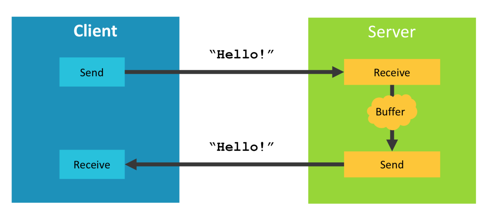
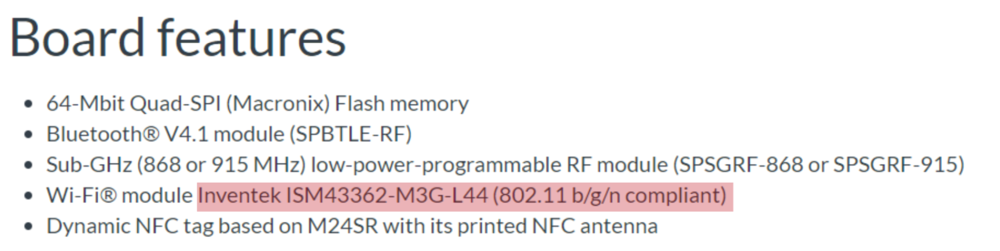
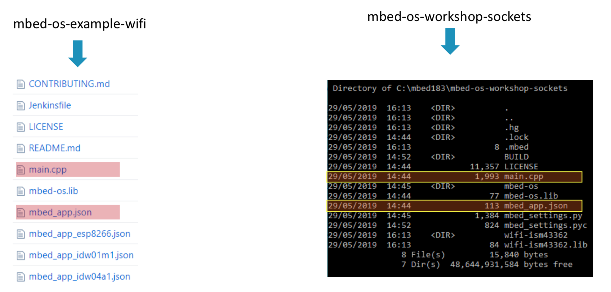

# Workshop 2 : Network Socket

このワークショップでは、以下を行います

* Ethernet接続用のサンプルコードをインポート
* Network Socket APIを使用し、サンプルコードをWi-Fi接続に変更
* ビルドとターゲットボードへの書き込み
* シリアルターミナルでアプリケーションの実行を確認

## Echo Server サンプルアプリケーション



（参考）  
https://en.wikipedia.org/wiki/Echo_Protocol

## インポートとビルド手順

このワークショップのサンプルコードはGitHubのリポジトリではありません。以下のコマンドでインポートします。

```
$ mbed import https://os.mbed.com/teams/Mbed-IoT-workshop/code/mbed-os-workshop-sockets
```
DISCO_L475VG_IOT01A用にビルドを行います。
```
$ cd mbed-os-workshop-sockets
$ mbed compile -m DISCO_L475VG_IOT01A -t gcc_arm
```

このサンプルコードはEthernet用なので、DISCO_L475VG_IOT01Aでビルドするとリンクエラーが発生します。

```
Link: mbed-os-workshop-sockets
BUILD/DISCO_L475VG_IOT01A/GCC_ARM/main.o: In function `__static_initialization_and_destruction_0':
/Users/toywat01/test/work/mbed-os-workshop-sockets/./main.cpp:7: undefined reference to `EMAC::get_default_instance()'
collect2: error: ld returned 1 exit status
```
これは、コード中で使用されているEthernetInterfaceのシンボルが見つからないためです。

```cpp
// TODO: include corresponding network driver header file
#include "EthernetInterface.h"

// TODO: define network interface object
EthernetInterface net;
```

# Wi-FI接続への変更方法

## Wi-Fiドライバの検索

DISCO_L475VG_IOT01Aボードのページを表示します。  

https://os.mbed.com/platforms/ST-Discovery-L475E-IOT01A/

featuresセクションから、Wi-Fiモジュールに関する記載を調べます。



GitHubのArmMbed配下で、`ISM43362`を検索します。以下のドライバが見つかります。

https://github.com/ARMmbed/wifi-ism43362

## ドライバのリポジトリ名とヘッダファイルの検索

* GitHubリポジトリ名 : wifi-ism43362
* ヘッダファイル名 : ISM43362Interface.h

以下のコマンドでWi-Fiドライバを追加します。

```
$ mbed add wifi-ism43362
```

## Wi-Fi接続用のコンフィグレーション

接続用の設定は、Wi-Fi接続用サンプルコードの設定を参照にするのが簡単な方法です。

https://github.com/ARMmbed/mbed-os-example-wifi



## コンフィグレーションのヒント
Wi-Fi接続用サンプルコードでは、アクセスポイントのSSIDやパスワードは以下のように設定、使用されています。

https://github.com/ARMmbed/mbed-os-example-wifi

[mbed_app.json](https://github.com/ARMmbed/mbed-os-example-wifi/blob/700c55a8af59adc649626a903328830b48aa0b4f/mbed_app.json#L1-L17)

```json
{
    "config": {
        "wifi-ssid": {
            "help": "WiFi SSID",
            "value": "\"SSID\""
        },
        "wifi-password": {
            "help": "WiFi Password",
            "value": "\"PASSWORD\""
        }
    },
    "target_overrides": {
        "*": {
            "platform.stdio-convert-newlines": true
        }
    }
}
```

[main.cpp](https://github.com/ARMmbed/mbed-os-example-wifi/blob/700c55a8af59adc649626a903328830b48aa0b4f/main.cpp#L96)

```cpp
int ret = wifi->connect(MBED_CONF_APP_WIFI_SSID, MBED_CONF_APP_WIFI_PASSWORD, NSAPI_SECURITY_WPA_WPA2);
```

## ビルド時に自動生成されるmbed_config.hファイル

./BUILD/DISCO_L475VG_IOT01A/GCC_ARM/mbed_config.h

```cpp
// Automatically generated configuration file.
// DO NOT EDIT, content will be overwritten.

#ifndef __MBED_CONFIG_DATA__
#define __MBED_CONFIG_DATA__

// Configuration parameters
#define CLOCK_SOURCE                                                          USE_PLL_MSI                                                                                      // set by target:DISCO_L475VG_IOT01A
#define LPTICKER_DELAY_TICKS                                                  1                                                                                                // set by target:FAMILY_STM32
#define MBED_CONF_APP_WIFI_PASSWORD                                           "PASSWORD"                                                                                       // set by application
#define MBED_CONF_APP_WIFI_SSID                                               "SSID"                                                                                           // set by application
```

プログラム側では、`connect()`関数のパラメータとして、SSIDとパスワードを指定します。

main.cpp

```cpp
    int ret = net.connect(MBED_CONF_APP_WIFI_SSID, MBED_CONF_APP_WIFI_PASSWORD, NSAPI_SECURITY_WPA_WPA2);
```
以下のようにマクロが展開されます。

```cpp
    int ret = net.connect("SSID", "PASSWORD", NSAPI_SECURITY_WPA_WPA2);
```

## 手順のまとめ

* アプリケーション（サンプルコード）をインポートする
* アプリケーションをWi-Fi接続用に変更する
  * 適切なWi-Fiドライバを追加する `mbed add <GitHub repo name>`
  * `main.cpp`で適切なWi-Fiドライバのヘッダファイル(.h)をインクルードする
  * 使用するWi-Fiアクセスポイントの接続情報（SSID、パスワード、セキュリティ）を設定する
  * TCP Echo serverのアドレスとポートを確認する
  * 参考ドキュメント : 
    * https://os.mbed.com/docs/mbed-os/v5.13/apis/socket.html#socket-class-reference
* エコーメッセージを変更する
* `mbed_app.json`に設定を行う

# 回答編

mbed_app.json

```json
{
    "config": {
        "wifi-ssid": {
            "help": "WiFi SSID",
            "value": "\"SSID\""
        },
        "wifi-password": {
            "help": "WiFi Password",
            "value": "\"PASSWORD\""
        }
    },
    "target_overrides": {
        "*": {
            "platform.stdio-convert-newlines": true
        }
    }
}
```

main.cpp

```cpp
#include "mbed.h"

// TODO: include corresponding network driver header file
//#include "EthernetInterface.h"
#include "ISM43362Interface.h"

// TODO: define network interface object
//EthernetInterface net;
ISM43362Interface net;

// TODO: confirm IP address and port of TCP echo server

// Internal echo server
// #define echo_server "192.168.1.2"
// #define port 5001

// Public echo server
#define echo_server "echo.mbedcloudtesting.com"
#define port 7

// Socket demo
int main() {

    // Bring up the network interface
    printf("\nSimple TCP socket example\n");

    // TODO: Connect using either Ethernet or WiFi
    // Ethernet
    //int ret = net.connect();
    int ret = net.connect(MBED_CONF_APP_WIFI_SSID, MBED_CONF_APP_WIFI_PASSWORD, NSAPI_SECURITY_WPA_WPA2);

// 以下省略
```
